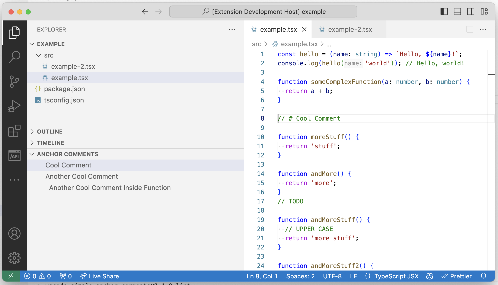

# vscode-simple-anchor-comments

This is more a learning exercise then a real polished VS Code extension, but feel free to use it. A better alternative is [Comment Anchors](https://marketplace.visualstudio.com/items?itemName=ExodiusStudios.comment-anchors).

## Features

This extension adds a small view to VS Code that allows you to easily jump to anchor comments of the current file. An **"anchor comment"** is a comment that starts with `// #`.

<p align="center">
    
</p>

## Installation

Install through VS Code extensions. Search for `vscode-simple-anchor-comments`

[Visual Studio Code Market Place: vscode-simple-anchor-comments](https://marketplace.visualstudio.com/items?itemName=donaldpipowitch.vscode-simple-anchor-comments)

Can also be installed in VS Code: Launch VS Code Quick Open (Ctrl+P), paste the following command, and press enter.

```
ext install donaldpipowitch.vscode-simple-anchor-comments
```

## Contribute

- Clone the project and run `$ npm install` inside.
- Preview any changes by pressing `F5` within VS Code. This will compile the extension and launch it in an example project.
- Run `$ npm run lint` if you made changes that you'd like to include.

## Publishing

- Follow [this guide](https://code.visualstudio.com/api/working-with-extensions/publishing-extension) for the general setup.
- Update `CHANGELOG.md`.
- Run `$ vsce publish {your.version.number}`.
